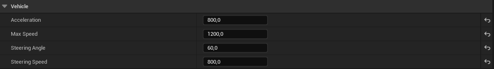

\# Technical Test – Unreal Engine 5.7.4 Vehicle Movement


\## Description


Ce projet Unreal Engine 5.7.4 présente un véhicule contrôlable par le joueur dans un environnement simple.  

Le véhicule répond aux entrées clavier (ZQSD) et à la souris pour la caméra.  

Le déplacement est géré en C++ dans la classe `AVehiclePawn`, tandis que la rotation visuelle des roues est gérée en Blueprint.


\---


\## Choix techniques


\- \*\*Langage :\*\* C++ pour la logique de mouvement, Blueprint pour la partie visuelle.

\- \*\*Système d’input :\*\* Enhanced Input (Input Mapping Context + Input Actions).

\- \*\*Type de Pawn :\*\* `APawn` avec `UFloatingPawnMovement` pour un contrôle simple et lisible.

\- \*\*Caméra :\*\* `USpringArmComponent` + `UCameraComponent` pour une vue troisième personne.

\- \*\*Mouvement :\*\*

&#x20; - Accélération progressive (`Acceleration`, `MaxSpeed`)

&#x20; - Friction et frein moteur (`FInterpTo`)

&#x20; - Direction progressive (`CurrentSteering`)

&#x20; - Rotation dépendante de la vitesse

&#x20; - Inversion de direction en marche arrière

\- \*\*Blueprint :\*\*

&#x20; - Tick Blueprint pour la rotation des roues (roulement + direction des roues avant)


\---


\## Réglages du mouvement du véhicule


Le comportement du véhicule est entièrement paramétrable depuis l’éditeur Unreal.  

Les variables de mouvement sont exposées dans la catégorie \*\*Vehicle\*\*, ce qui permet d’ajuster facilement la sensation de conduite sans modifier le code.


Voici les paramètres disponibles :





\### Description des paramètres


\- \*\*Acceleration\*\* : force appliquée à chaque Tick pour augmenter la vitesse  

\- \*\*Max Speed\*\* : vitesse maximale (marche avant et arrière)  

\- \*\*Steering Angle\*\* : angle maximal du volant  

\- \*\*Steering Speed\*\* : vitesse d’interpolation de la direction  


Ces réglages permettent de tester rapidement différents comportements :

\- conduite arcade (accélération forte, steering rapide)

\- conduite réaliste (accélération faible, steering lent)

\- véhicule lourd ou léger

\- tests de gameplay rapides sans recompilation


\---


\## Lancer le projet


1\. Cloner le dépôt :

&#x20;  ```bash

&#x20;  git clone <URL\_DU\_REPO>


